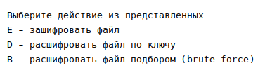
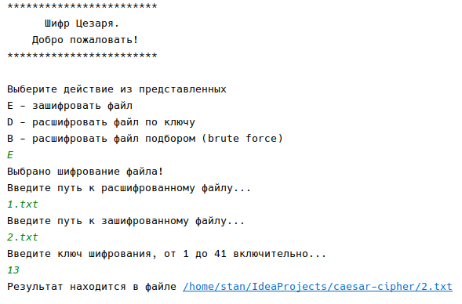
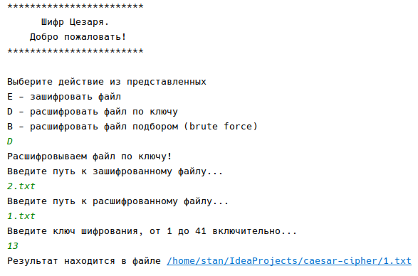
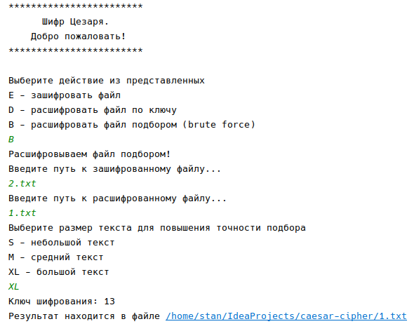

# Caesar Cipher cryptoanalyzer

## Краткое описание  

> Шифр Цезаря — это шифр подстановки: в нем каждый символ в открытом тексте заменяется на символ, который находится на некотором постоянном числе позиций левее или правее него в алфавите.

*Поддерживаются следующие режимы:*  
* шифрование по ключу  
* расшифровка при известном ключе  
* расшифровка методом brute force

## Описание работы  

При запуске предлагается выбрать один из вариантов работы с текстом:

### Шифрование по ключу
*При выборе варианта, после предложения, необходимо ввести*  
* путь к исходному файлу с незашифрованным текстом  
* путь к файлу в который будет записан результат шифрования  
* ключ шифрования  

### Расшифровка при известном ключе
*При выборе варианта, после предложения, необходимо ввести* 
* путь к зашифрованному файлу  
* путь к файлу в который будет записан расшифрованный результат  
* ключ шифрования  

### Расшифровка методом brute force
*При выборе варианта, после предложения, необходимо ввести* 
* путь к зашифрованному файлу  
* путь к файлу в который будет записан расшифрованный результат  
* выбрать ключ, соответствующий размеру зашифрованного текста  

По окончании работы в консоль будет выведена ссылка на файл с результатом.    

## Ограничения

* В шифровании участвует кириллический алфавит и некоторые знаки препинания.  
* При выборе режима программы следует выбирать только из представленных, другие варианты не принимаются.  
* Файлы проверяются на существование по указанному пути.  
* Ключ шифрования имеет ограничение определенным диапазоном.  
* Расшифровка методом brute force предполагает конечный текст с корректно расставленными знаками препинания и размером от 1 абзаца.
* Выбор размера текста также ограничен 3 вариантами.

## Краткое описание классов

Пакет `cipher` содержит классы  
* `CaesarCipher` - описывает основную логику шифрования/расшифровки  

Пакет `dialog` содержит классы   
* `ConsoleText` - содержит строковые константы для диалога с пользователем  
* `UserDialog` - описывает диалог с пользователем

класс `Main` - точка входа в программу  

## Запуск

### Из IntellijIDEA
* Запустить класс `Main`  
* Меню `Run` ---> `Run 'Main' (Shift+F10)`   

Также можно сделать исполняемый файл и запустить его следующим образом:  
* `File` ---> `Project Structure` ---> `(Project Settings) Artifacts` ---> `+` ---> `JAR` ---> `From modules with dependencies`  
* В окне у поля `Main Class:` выбираем путь к классу `Main` ---> `OK`  
* Меню `Build` ---> `Build Artifacts`  

Исполняемыый `.jar`-файл будет находиться здесь --> `/out/artifacts/caesar_cipher_jar/caesar-cipher.jar`   

### Из консоли
При запуске исполняемого `.jar`-файла необходима установленная в системе версия `jdk15` и выше  
Проверить версию можно коммандой `java -version` и `javac -version`

Вводим команду из каталога с файлом либо прописываем путь к файлу перед именем  

    java -jar caesar-cipher.jar  

## Примеры

----------

----------

